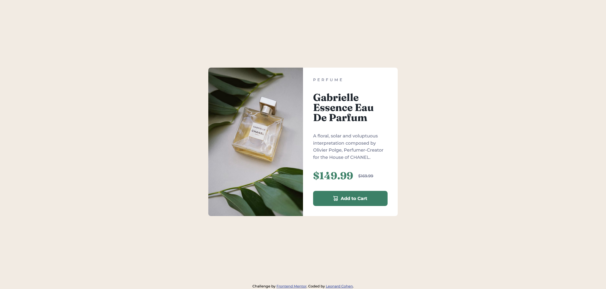

# Frontend Mentor - Product preview card component solution

This is a solution to the [Product preview card component challenge on Frontend Mentor](https://www.frontendmentor.io/challenges/product-preview-card-component-GO7UmttRfa). Frontend Mentor challenges help you improve your coding skills by building realistic projects. 

## Table of contents

- [Overview](#overview)
  - [The challenge](#the-challenge)
  - [Screenshot](#screenshot)
  - [Links](#links)
- [My process](#my-process)
  - [Built with](#built-with)
  - [What I learned](#what-i-learned)
  - [Continued development](#continued-development)
- [Author](#author)

**Note: Delete this note and update the table of contents based on what sections you keep.**

## Overview

### The challenge

Your challenge is to build out this product preview card component and get it looking as close to the design as possible.

You can use any tools you like to help you complete the challenge. So if you've got something you'd like to practice, feel free to give it a go.

Your users should be able to:

- View the optimal layout depending on their device's screen size
- See hover and focus states for interactive elements

### Screenshot

### Links

- Solution URL: [https://github.com/lenny131/product-preview-card-component](https://github.com/lenny131/product-preview-card-component)
- Live Site URL: [https://lenny131.github.io/product-preview-card-component](https://lenny131.github.io/product-preview-card-component)

## My process

### Built with

- HTML and CSS
- Sass

### What I learned

- Sass - this was especially useful for mixins and partials
- Using rem instead of px to adapt to user's choice of default font size
- `<picture>` for responsive image
- CSS logical properties for text-direction-agnostic design.

### Continued development

Continue practicing HTML, CSS, and Javascript, and then learn React and other frontend libraries and frameworks.

## Author

- Website - [Leonard Cohen](https://leonardmcohen.com)
- Frontend Mentor - [lenny131](https://www.frontendmentor.io/profile/lenny131)
